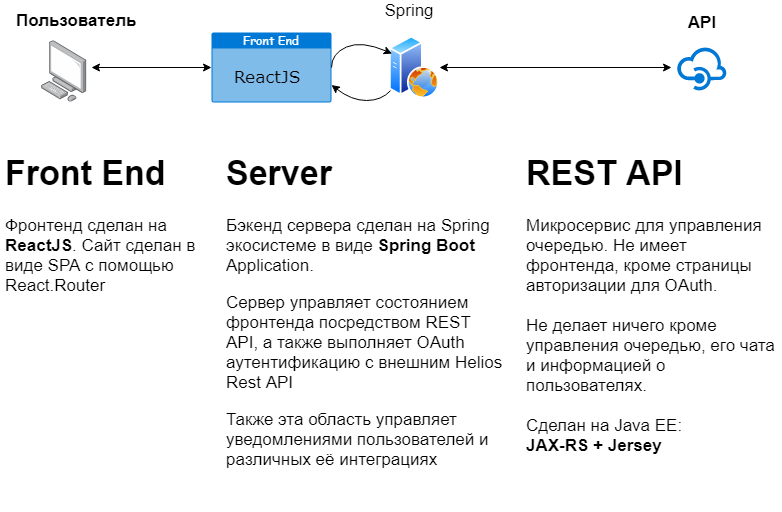

<h1 align=center>HELIOS QUEUE SERVICE</h1>

## Схема работы всей экосистемы

## Репозитории действующих проектов
* [Front End (ReactJS)](https://github.com/AppLoidx/helios-front-end)
* [Backend (Spring Boot)](https://github.com/AppLoidx/helios-backend)
* [REST API (JAX-RS)](https://github.com/AppLoidx/helios-rest-api)

## Об архитектуре приложения

Думая над архитектурой проекта, я старался сделать так, чтобы он мог быть расширен и имел 
достаточную гибкость и пространство для масштабирования.

Если со связкой `Spring Boot + ReactJS` все понятно (MVC), то зачем понадобился внешний API?

Да, можно было не писать внешний API и поместить все на бэкенд (так было бы намного легче, как 
для разработки, так и для дальнейшей поддержки). Но я посчитал, что нужен внешний API, чтобы желающие
люди могли имплементировать его в свои приложения - создать какого-нибудь бота или отдельный сервис,
у которого будет возможность управлять очередью.

На мой взгляд, очень интересно будет создавать свои приложения поддерживающие общедоступный и единый
API.

Сыграл еще и немаловажный факт, то что я только учился веб-программированию и хотел узнать больше технологий.
Именно поэтому, технология примененная для API (JAX-RS + Jersey + Grizzly) отличается от технологии на
бэкенде (Spring Boot + Spring Web Service).

Таким образом, мы имеем три почти независимые проекты, а следовательно сложность проекта довольно сильно повысилась.

## Предисловие. Сложности создания веб-приложения

Разумеется, было сложно быстро получить знания и сразу применять их на практике. Это также сильно замедляло
общий процесс разработки. Но самое сложное было не в этом.

Во-первых, на всех трех проектах использовались разные технологии и совершенно разный подход к проблеме.

Во-вторых, было трудно согласовать все эти три технологии. Во многом из-за того что не было опыта. Я не
мог сначала полностью закончить одну и потому другую. Многое было неизвестно и если пойти по неправильному
пути - в итоге это могло обернуться рефакторингом всего проекта. Поэтому по чуть-чуть, исследуя путь, я вносил
изменения в каждый их них почти параллельно.